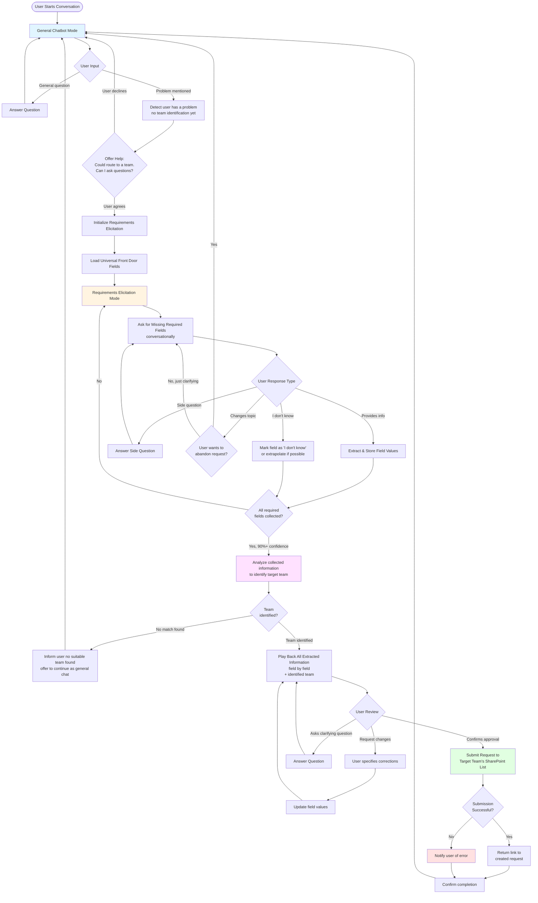

# Product Requirements Document: Consolidated Front Door (CFD) Agent

## 1. Overview

The Consolidated Front Door (CFD) Agent is an M365 custom agent that serves as a unified interface for employees to submit requests to various internal teams without needing to know which team handles specific issues or how to access their individual front door processes.

### 1.1 Purpose
- Consolidate hundreds of team-specific front door processes into a single conversational interface
- Intelligently route user requests to the appropriate team
- Streamline the request submission process through conversational requirements elicitation
- Function as a general-purpose chatbot with integrated request routing capabilities

## 2. Non-Functional Requirements

### 2.1 Development Environment
- **Platform**: macOS development environment
- **Debugging**: M365 Agent Playground (local development)
- **Authentication**: No SSO or Microsoft tenant features required for POC
- **Deployment Target**: Teams and M365 Copilot (production)

### 2.2 Architecture Principles
- **Maintainability**: Clean, simple architecture
- **Minimal Complexity**: Not over-engineered
- **Robustness**: Extremely reliable core behavior
- **Simplicity First**: Use simple solutions where possible

### 2.3 Technology Stack
- **Backend Framework**: LangChain with LangGraph for complex conversational flows
- **Platform**: M365 Agents SDK
- **Integration**: SharePoint Lists API

## 3. Functional Requirements

### 3.1 Dual-Mode Operation

The CFD Agent operates in two complementary modes:

#### 3.1.1 General Chatbot Mode
- Users can have normal conversations about any topic (weather, personal problems, work issues)
- Agent responds naturally without forcing request submission
- No functional limitations on conversation topics

#### 3.1.2 Request Routing Mode
- Agent detects when user mentions a problem (without identifying specific team yet)
- Gently prompts user: "This could be a potential request that we could route to a team. To better understand your problem, I need to ask you a few questions. Are you okay with that?"
- User maintains full control to:
  - Agree and proceed with requirements elicitation
  - Decline and return to general chatbot mode
  - Change topics
- **Team identification happens after requirements are collected, not before**

### 3.2 Requirements Elicitation Flow

When user chooses to submit a request, the agent enters a flexible requirements gathering mode:

#### 3.2.1 Flow Characteristics
- **Non-Binary**: Not a strict on/off mode
- **Interruptible**: User can ask side questions mid-flow
- **Resumable**: Agent returns to gathering remaining requirements after answering side questions
- **Human-Like**: Behaves like a knowledgeable human assistant

#### 3.2.2 Elicitation Behavior
- Ask questions conversationally (can ask multiple at once)
- Handle partial answers (user answers only some questions)
- Iteratively gather remaining information
- Allow "I don't know" responses and extrapolate when possible
- Mark fields as "I don't know" when information unavailable
- Continue until all required fields are collected

### 3.3 Universal Front Door Structure

All teams share a standardized SharePoint list structure with identical columns/fields.

**Required Fields**: *(To be provided - placeholder for universal requirements)*
- Field 1
- Field 2
- Field 3
- etc.

### 3.4 Request Confirmation & Submission

#### 3.4.1 Pre-Submission Review
When agent has collected all required information (90%+ confidence):
1. Play back all extracted information to user
2. Map each piece of information to corresponding front door field
3. Allow user to review and make corrections
4. Wait for explicit user confirmation

#### 3.4.2 Submission Process
Upon user approval:
1. Submit request to target team's SharePoint list
2. Return link to newly created request
3. Confirm submission success

#### 3.4.3 Post-Submission
- User can continue normal conversation
- User can initiate new request
- No forced conversation termination

### 3.5 Team Knowledge Base

Agent requires access to:
- List of all internal teams
- Team responsibilities and specializations
- Team capabilities and problem domains
- SharePoint list URL for each team's front door

## 4. Conversational Flow

The following Mermaid diagram illustrates the conversational flow, decision points, and cycles:

## 5. Key Decision Points in Flow

### 5.1 Problem Detection
**Decision**: Has user mentioned a problem (not identifying team yet)?
- **Input**: User conversation indicating they have an issue/request
- **Output**: Problem detected or general conversation
- **Action**: Offer to start requirements elicitation or continue chat

### 5.2 Elicitation Entry
**Decision**: Does user want to proceed with request?
- **Input**: User's explicit agreement or decline
- **Output**: Enter elicitation mode or stay in chat mode
- **Action**: Initialize field collection or continue conversation

### 5.3 Response Interpretation (Cyclical)
**Decision**: What type of response did user provide?
- **Input**: User's message during elicitation
- **Options**:
  - Field information → Extract and store
  - "I don't know" → Mark field or extrapolate
  - Side question → Answer and resume
  - Topic change → Assess abandonment or continue
- **Action**: Loop until all fields collected

### 5.4 Completeness Check (Cyclical)
**Decision**: Are all required fields collected?
- **Input**: Current field completion status
- **Output**: Complete or incomplete
- **Action**: Continue elicitation or proceed to team identification

### 5.5 Team Identification
**Decision**: Which team should handle this request?
- **Input**: All collected field information, team knowledge base
- **Output**: Specific team match or no match found
- **Action**: Proceed to review with identified team or inform user no team found

### 5.6 User Approval
**Decision**: Does user approve the extracted information?
- **Input**: User confirmation after playback
- **Options**:
  - Approve → Submit
  - Request changes → Update and re-playback
  - Ask questions → Answer and re-playback
- **Action**: Submit request or iterate

## 6. Architectural Considerations

### 6.1 State Management
- Maintain conversation context across turns
- Track current mode (chat vs. elicitation)
- Store partially collected field values
- Preserve conversation history for context

### 6.2 LangGraph Usage
- Model cyclical requirements elicitation as graph nodes
- Handle interruptions and resumptions
- Manage state transitions between modes
- Support non-linear conversation flows

### 6.3 SharePoint Integration
- Interface with SharePoint Lists API
- Map universal fields to list columns
- Handle submission errors gracefully
- Return created item links

### 6.4 Team Matching Logic
- Analyze all collected field information (not just initial problem description)
- Compare against team capabilities and responsibilities
- Rank potential team matches based on complete context
- Identify single best team match
- Handle cases where no suitable team is found

## 7. Success Criteria

### 7.1 Core Functionality
- ✅ Agent successfully operates as general chatbot
- ✅ Agent correctly identifies problems requiring team routing
- ✅ Agent gathers all required fields conversationally
- ✅ Agent handles interruptions and side questions
- ✅ Agent submits requests to correct SharePoint lists
- ✅ Agent returns valid request links to users

### 7.2 User Experience
- ✅ Conversations feel natural and human-like
- ✅ Users maintain control of conversation flow
- ✅ Request submission process is clear and transparent
- ✅ Agent never forces unwanted actions

### 7.3 Technical Quality
- ✅ Code is clean and maintainable
- ✅ Architecture is simple and not over-engineered
- ✅ System is robust and handles errors gracefully
- ✅ Solution uses appropriate complexity for the problem

## 8. Out of Scope (POC)

The following are explicitly out of scope for this proof of concept:
- SSO integration
- Microsoft tenant authentication
- Production M365 deployment
- Multi-tenant support
- Advanced security features
- Performance optimization at scale
- Analytics and telemetry

## 9. Future Considerations

Items to consider for post-POC development:
- Integration with M365 Copilot
- SSO and tenant authentication
- Request status tracking
- Team-specific custom fields (beyond universal structure)
- Multi-language support
- Request history and analytics
- Feedback mechanism for routing accuracy

## 10. Open Questions

1. What are the specific universal front door fields required?
2. How many teams will be included in the initial POC?
3. What is the format of the team knowledge base?
4. How should the agent prioritize when multiple teams could handle a request?
5. Should users be able to submit requests to multiple teams simultaneously?
6. What error handling is required for SharePoint API failures?
7. Should the agent learn from past routing decisions?

## 11. Appendices

### 11.1 Universal Front Door Fields
*(To be populated)*

### 11.2 Team Directory Structure
*(To be populated)*

### 11.3 SharePoint List Schema
*(To be populated)*