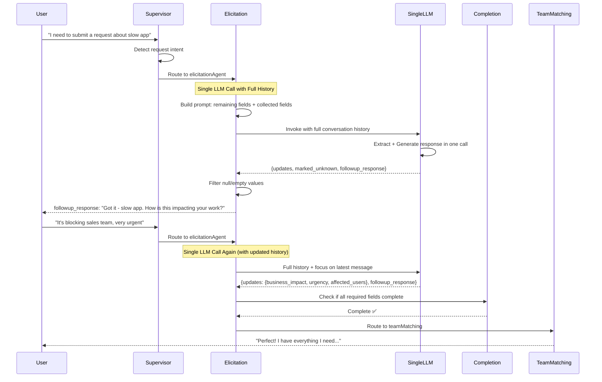
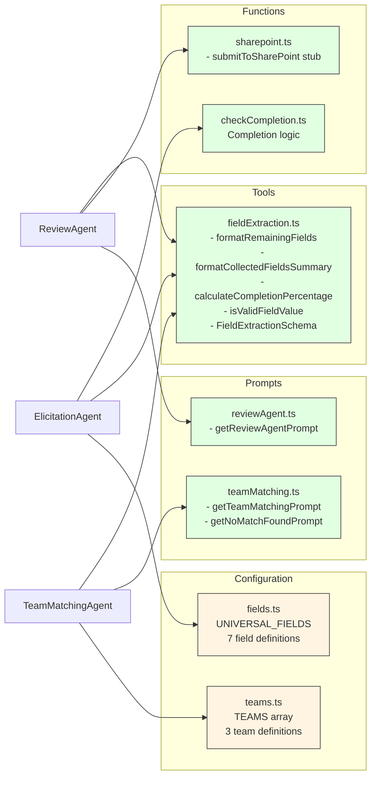

# CFD Agent - Current Implementation Progress

## Phase 1-5 Conversational Flow Diagram (Implemented Architecture)

```mermaid
graph TD
    Start([User Starts Conversation]) --> WelcomeMsg[Welcome Message Sent]
    WelcomeMsg --> UserInput{User Sends Message}

    UserInput --> GraphInvoke[graph.invoke with conversationId]
    GraphInvoke --> Supervisor[SupervisorAgent]

    Supervisor --> AnalyzeIntent[Analyze User Intent & Current Mode]
    AnalyzeIntent --> SupervisorLLM[LLM Call: Determine Routing]
    SupervisorLLM --> UpdateMode[Update State: mode, next]

    UpdateMode --> RouteDecision{Routing Decision}

    %% Chat Agent Path
    RouteDecision -->|next = chatAgent| ChatAgent[ChatAgent]
    ChatAgent --> ChatLLM[LLM Call: Generate Response]
    ChatLLM --> ChatResponse[Return Response Message]
    ChatResponse --> EndTurn1[END - Return to User]

    %% Review Agent Path
    RouteDecision -->|next = reviewAgent| ReviewAgent[ReviewAgent<br/>Phase 5 - Review & Submit]
    ReviewAgent --> ReviewLLM[LLM Call: Classify User Action]
    ReviewLLM --> ReviewAction[Structured Output:<br/>action_type, reasoning,<br/>response_to_user]
    ReviewAction --> ActionType{Action Type?}

    ActionType -->|confirm| SharePointSubmit[Call submitToSharePoint]
    SharePointSubmit --> SubmitSuccess{Success?}
    SubmitSuccess -->|Yes| SubmitOK[Return success + URL<br/>mode = CHAT]
    SubmitSuccess -->|No| SubmitError[Return error message<br/>mode = REVIEW stay]
    SubmitOK --> EndTurn5[END - Return to User]
    SubmitError --> EndTurn6[END - Return to User]

    ActionType -->|modify| ModifyState[Set mode = ELICITATION]
    ModifyState --> EndTurn7[END - Return to User<br/>Supervisor will route to ElicitationAgent]

    ActionType -->|abandon| ClearState[Clear collectedFields,<br/>identifiedTeam, etc.<br/>mode = CHAT]
    ClearState --> EndTurn8[END - Return to User]

    ActionType -->|clarify| AnswerQuestion[Answer user's question<br/>mode = REVIEW stay]
    AnswerQuestion --> EndTurn9[END - Return to User]

    %% Simplified Elicitation Agent Path - Single LLM Call
    RouteDecision -->|next = elicitationAgent| ElicitAgent[ElicitationAgent]
    ElicitAgent --> BuildPrompt[Build System Prompt:<br/>- Remaining fields<br/>- Collected fields<br/>- Completion %]
    BuildPrompt --> AddHistory[Add Full Conversation History]
    AddHistory --> AddFocus{First Entry?}
    AddFocus -->|No| FocusMsg[Add Focus Instruction:<br/>Latest user message]
    AddFocus -->|Yes| SingleLLM[Single LLM Call with Structured Output]
    FocusMsg --> SingleLLM

    SingleLLM --> StructuredOutput[FieldExtractionSchema Output:<br/>updates, marked_unknown,<br/>reasoning, followup_response]
    StructuredOutput --> FilterNull[Filter null/empty values<br/>from updates]
    FilterNull --> UpdateState[Update State:<br/>collectedFields += updates<br/>fieldsMarkedUnknown += marked_unknown]
    UpdateState --> ReturnFollowup[Return followup_response<br/>as AIMessage]
    ReturnFollowup --> CompletionCheck{Check Completion:<br/>areAllRequiredFieldsComplete?}

    %% Completion Routing
    CompletionCheck -->|Incomplete| EndTurn2[END - Return to User]
    CompletionCheck -->|Complete| TeamMatch[TeamMatchingAgent<br/>Phase 4 - LLM Matching]

    TeamMatch --> LogComplete[Log Collected Fields Summary]
    LogComplete --> TeamMatchLLM[LLM Call: Analyze fields<br/>Match to best team]
    TeamMatchLLM --> TeamMatchOutput[Structured Output:<br/>team_id, confidence, reasoning]
    TeamMatchOutput --> TeamFound{Team Found?}

    %% Team Match Success Path
    TeamFound -->|Yes - team_id exists| FormatReview[formatReviewMessage:<br/>NO LLM CALL<br/>Construct review display]
    FormatReview --> UpdateTeamInfo[Update State:<br/>identifiedTeam = team_id<br/>identifiedTeamName = team.name<br/>mode = REVIEW]
    UpdateTeamInfo --> TeamSuccessMsg[Return Review Message:<br/>Shows collected fields + team<br/>Explains 4 actions]
    TeamSuccessMsg --> EndTurn3[END - Return to User]

    %% No Team Match Path
    TeamFound -->|No - team_id is null| NoMatchLLM[Separate LLM Call:<br/>getNoMatchFoundPrompt]
    NoMatchLLM --> PlaybackMsg[Generate Response:<br/>- Play back collected info<br/>- Ask for more detail/different angle]
    PlaybackMsg --> ResetToChat[Update State:<br/>mode = CHAT]
    ResetToChat --> EndTurn4[END - Return to User]

    %% Loop Back
    EndTurn1 --> WaitUser[Wait for Next User Message]
    EndTurn2 --> WaitUser
    EndTurn3 --> WaitUser
    EndTurn4 --> WaitUser
    EndTurn5 --> WaitUser
    EndTurn6 --> WaitUser
    EndTurn7 --> WaitUser
    EndTurn8 --> WaitUser
    EndTurn9 --> WaitUser
    WaitUser --> UserInput

    %% Styling
    classDef agentNode fill:#e1f5ff,stroke:#333,stroke-width:2px
    classDef llmNode fill:#fff4e1,stroke:#333,stroke-width:2px
    classDef stateNode fill:#e1ffe1,stroke:#333,stroke-width:2px
    classDef decisionNode fill:#ffe1ff,stroke:#333,stroke-width:2px
    classDef processNode fill:#ffe1e1,stroke:#333,stroke-width:2px

    class Supervisor,ChatAgent,ElicitAgent,TeamMatch,ReviewAgent agentNode
    class SupervisorLLM,ChatLLM,SingleLLM,ReviewLLM llmNode
    class UpdateMode,UpdateState,UpdateTeamInfo,ModifyState,ClearState stateNode
    class RouteDecision,AddFocus,CompletionCheck,TeamFound,ActionType,SubmitSuccess decisionNode
    class BuildPrompt,AddHistory,FocusMsg,StructuredOutput,FilterNull,ReturnFollowup,FormatReview processNode
```



## State Schema (Phase 1-5)

```mermaid
graph LR
    State[AgentState] --> Messages[messages: BaseMessage<br/>Conversation history]
    State --> Mode[mode: AgentMode<br/>CHAT | ELICITATION | TEAM_MATCHING | REVIEW]
    State --> Next[next: string<br/>Next agent to route to]
    State --> CollectedFields[collectedFields: CollectedFields<br/>request_summary, business_impact,<br/>urgency, affected_users, request_type,<br/>department, desired_resolution]
    State --> FieldsUnknown[fieldsMarkedUnknown: string<br/>Fields user doesn't know]
    State --> IdentifiedTeam[identifiedTeam: string | null<br/>Team ID after matching]
    State --> IdentifiedTeamName[identifiedTeamName: string | null<br/>Team display name]
    State --> SharePointURL[sharepoint_item_url: string | null<br/>URL after successful submission]
    State --> SubmissionError[submission_error: string | null<br/>Error if submission fails]

    classDef stateField fill:#e1ffe1,stroke:#333,stroke-width:1px
    class Messages,Mode,Next,CollectedFields,FieldsUnknown,IdentifiedTeam,IdentifiedTeamName,SharePointURL,SubmissionError stateField
```

## Agent Responsibilities

```mermaid
graph TD
    subgraph SupervisorAgent
        S1[Analyze user intent & current mode]
        S2[Make routing decision]
        S3[Update mode if needed]
        S1 --> S2 --> S3
    end

    subgraph ChatAgent
        C1[Handle general conversation]
        C2[Answer questions naturally]
        C3[Maintain conversational tone]
        C1 --> C2 --> C3
    end

    subgraph ElicitationAgent
        E1[Single LLM call with full history]
        E2[Structured output extraction + response]
        E3[Extract: updates, marked_unknown, followup_response]
        E4[Filter null/empty values]
        E5[Return followup_response directly]
        E1 --> E2 --> E3 --> E4 --> E5
    end

    subgraph TeamMatchingAgent
        T1[Log collected fields summary]
        T2[LLM Call: Match to best team]
        T3[Structured output: team_id, confidence, reasoning]
        T4{Team found?}
        T5[Success: Format review message NO LLM]
        T6[Update state with team info, mode=REVIEW]
        T7[No match: Separate LLM call with dedicated prompt]
        T8[Generate playback + ask for more detail]
        T9[Reset mode to CHAT]
        T1 --> T2 --> T3 --> T4
        T4 -->|Yes| T5 --> T6
        T4 -->|No| T7 --> T8 --> T9
    end

    subgraph ReviewAgent
        R1[LLM Call: Classify user action]
        R2[Structured output: action_type, reasoning, response]
        R3{Action type?}
        R4[Confirm: Submit to SharePoint]
        R5[Modify: Set mode=ELICITATION]
        R6[Abandon: Clear state, mode=CHAT]
        R7[Clarify: Answer question, stay in REVIEW]
        R1 --> R2 --> R3
        R3 -->|confirm| R4
        R3 -->|modify| R5
        R3 -->|abandon| R6
        R3 -->|clarify| R7
    end

    classDef agent fill:#e1f5ff,stroke:#333,stroke-width:2px
    class SupervisorAgent,ChatAgent,ElicitationAgent,TeamMatchingAgent,ReviewAgent agent
```



## Field Collection Process (Simplified)



## Key Decision Points

| Decision Point | Logic | Outcomes |
|---------------|-------|----------|
| **Supervisor Routing** | Analyze user intent + current mode | → chatAgent<br>→ elicitationAgent<br>→ reviewAgent |
| **Elicitation Focus** | Check if first entry (collectedFields empty) | First → Analyze full history<br>Subsequent → Focus on latest + full history context |
| **Field Extraction** | Single LLM call with `FieldExtractionSchema` | Extract: updates, marked_unknown, reasoning, followup_response |
| **Completion Check** | All required fields filled OR marked unknown | Complete → teamMatching<br>Incomplete → END (ask more) |
| **Team Matching** | LLM analyzes fields against all team descriptions | team_id found → formatReviewMessage + mode=REVIEW<br>team_id null → mode=CHAT (no match) |
| **No Match Handling** | Separate LLM call with dedicated prompt | Play back info + ask for more detail → CHAT mode |
| **Review Action Classification** | LLM classifies user's response to review | confirm → SharePoint<br>modify → ELICITATION<br>abandon → CHAT (clear state)<br>clarify → REVIEW (stay) |
| **SharePoint Submission** | Call submitToSharePoint stub | Success → return URL + mode=CHAT<br>Failure → error + mode=REVIEW (retry) |

## Tools & Helpers (Phase 1-5)



## Universal Front Door Fields (7 Total)

| Field Name | Type | Required | Description |
|------------|------|----------|-------------|
| `request_summary` | string | ✅ Yes | Brief description of the issue |
| `business_impact` | string | ✅ Yes | How this affects work/business |
| `urgency` | enum | ✅ Yes | low, medium, high, critical |
| `affected_users` | string | ❌ No | Who else is impacted |
| `request_type` | enum | ✅ Yes | incident, service_request, question, access_request, other |
| `department` | string | ✅ Yes | Department or team making the request |
| `desired_resolution` | string | ✅ Yes | Expected outcome or resolution |

## Available Teams (3 Total)

| Team ID | Team Name | Specialization |
|---------|-----------|----------------|
| `identity_access_team` | Identity & Access Management Team | Authentication, login, SSO, MFA, permissions, account access |
| `performance_engineering_team` | Performance Engineering Team | App performance, latency, slow loading, timeouts, crashes |
| `data_analytics_team` | Data & Analytics Team | Reports, dashboards, data exports, analytics, BI tools |

## Implementation Status

- ✅ **Phase 1**: Basic Chat Agent (completed)
- ✅ **Phase 2**: Supervisor + Mode Routing (completed)
- ✅ **Phase 3**: Requirements Elicitation Loop (completed)
- ✅ **Phase 4**: Team Matching (completed)
  - LLM-based team identification with structured output
  - 3 teams configured (Identity, Performance, Data Analytics)
  - Graceful "no match" handling with dedicated prompt
  - Automatic fallback to CHAT mode if no suitable team
- ✅ **Phase 5**: Review & Submission (completed)
  - ReviewAgent with 4 action types (confirm/modify/abandon/clarify)
  - Deterministic review message construction (no extra LLM call)
  - SharePoint stub tool for testing
  - Full state management for submission tracking
  - Graceful error handling with retry capability
- ⏳ **Phase 6**: SharePoint Integration (next)

## Phase 4-5 Implementation Details

### Team Matching Flow (Phase 4)
1. **LLM Analysis**: Uses `getTeamMatchingPrompt()` with all team descriptions and collected fields
2. **Structured Output**: Returns `team_id` (or null), `confidence`, and `reasoning`
3. **Success Path**:
   - Calls `formatReviewMessage()` helper (deterministic, no LLM)
   - Updates state with `identifiedTeam` and `identifiedTeamName`
   - Sets mode to `REVIEW`
   - Returns formatted review message showing all fields + 4 action options
4. **No Match Path**:
   - Separate LLM call with `getNoMatchFoundPrompt()`
   - Plays back collected information naturally
   - Asks user for more detail or different angle
   - Resets mode to `CHAT` for continued conversation

### Review & Submission Flow (Phase 5)
1. **User Sees Review**: TeamMatching displays review message with 4 options
2. **User Responds**: Supervisor routes to ReviewAgent based on mode=REVIEW
3. **Action Classification**: ReviewAgent uses structured output to identify action:
   - **Confirm**: Calls `submitToSharePoint()` stub → Success message with URL → mode=CHAT
   - **Modify**: Sets mode=ELICITATION → Supervisor routes back to ElicitationAgent → Re-extracts → TeamMatching runs again
   - **Abandon**: Clears `collectedFields`, `identifiedTeam`, etc. → mode=CHAT
   - **Clarify**: Answers user's question → Stays in REVIEW mode
4. **Error Handling**: If SharePoint submission fails, stays in REVIEW with error message for retry

### Key Design Decisions
- **Two separate prompts (Phase 4)**: Focused prompts avoid pollution with unrelated instructions
- **LLM over rules**: Semantic matching handles variations better than keyword matching
- **Graceful degradation**: "No match" returns to conversation naturally
- **No reviewDisplayed flag (Phase 5)**: TeamMatching constructs review message deterministically
- **4 action types**: Comprehensive coverage of user intents during review
- **State clearing on abandon**: Ensures clean slate for new requests
- **Modify loops back to elicitation**: Leverages existing extraction logic
- **Future-ready**: Easy to extend to vector search with 100+ teams and real SharePoint API