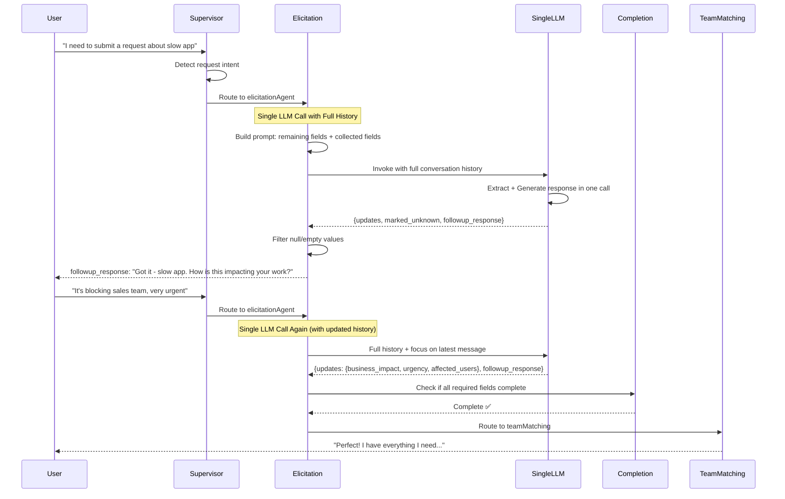
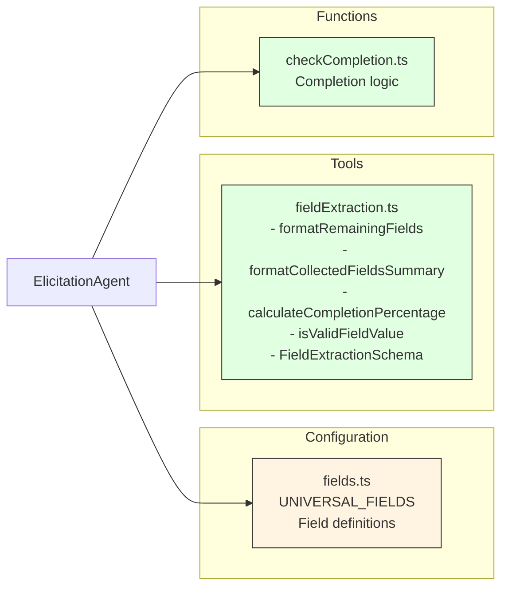

# CFD Agent - Current Implementation Progress

## Phase 1-3 Conversational Flow Diagram (Simplified Architecture)

```mermaid
graph TD
    Start([User Starts Conversation]) --> WelcomeMsg[Welcome Message Sent]
    WelcomeMsg --> UserInput{User Sends Message}

    UserInput --> GraphInvoke[graph.invoke with conversationId]
    GraphInvoke --> Supervisor[SupervisorAgent]

    Supervisor --> AnalyzeIntent[Analyze User Intent & Current Mode]
    AnalyzeIntent --> SupervisorLLM[LLM Call: Determine Routing]
    SupervisorLLM --> UpdateMode[Update State: mode, next]

    UpdateMode --> RouteDecision{Routing Decision}

    %% Chat Agent Path
    RouteDecision -->|next = chatAgent| ChatAgent[ChatAgent]
    ChatAgent --> ChatLLM[LLM Call: Generate Response]
    ChatLLM --> ChatResponse[Return Response Message]
    ChatResponse --> EndTurn1[END - Return to User]

    %% Simplified Elicitation Agent Path - Single LLM Call
    RouteDecision -->|next = elicitationAgent| ElicitAgent[ElicitationAgent]
    ElicitAgent --> BuildPrompt[Build System Prompt:<br/>- Remaining fields<br/>- Collected fields<br/>- Completion %]
    BuildPrompt --> AddHistory[Add Full Conversation History]
    AddHistory --> AddFocus{First Entry?}
    AddFocus -->|No| FocusMsg[Add Focus Instruction:<br/>Latest user message]
    AddFocus -->|Yes| SingleLLM[Single LLM Call with Structured Output]
    FocusMsg --> SingleLLM

    SingleLLM --> StructuredOutput[FieldExtractionSchema Output:<br/>updates, marked_unknown,<br/>reasoning, followup_response]
    StructuredOutput --> FilterNull[Filter null/empty values<br/>from updates]
    FilterNull --> UpdateState[Update State:<br/>collectedFields += updates<br/>fieldsMarkedUnknown += marked_unknown]
    UpdateState --> ReturnFollowup[Return followup_response<br/>as AIMessage]
    ReturnFollowup --> CompletionCheck{Check Completion:<br/>areAllRequiredFieldsComplete?}

    %% Completion Routing
    CompletionCheck -->|Incomplete| EndTurn2[END - Return to User]
    CompletionCheck -->|Complete| TeamMatch[TeamMatchingAgent<br/>Phase 4 Stub]

    TeamMatch --> LogComplete[Log Collected Fields Summary]
    LogComplete --> TeamMsg[Return Completion Message]
    TeamMsg --> UpdateTeamMode[Update State: mode=TEAM_MATCHING]
    UpdateTeamMode --> EndTurn3[END - Return to User]

    %% Loop Back
    EndTurn1 --> WaitUser[Wait for Next User Message]
    EndTurn2 --> WaitUser
    EndTurn3 --> WaitUser
    WaitUser --> UserInput

    %% Styling
    classDef agentNode fill:#e1f5ff,stroke:#333,stroke-width:2px
    classDef llmNode fill:#fff4e1,stroke:#333,stroke-width:2px
    classDef stateNode fill:#e1ffe1,stroke:#333,stroke-width:2px
    classDef decisionNode fill:#ffe1ff,stroke:#333,stroke-width:2px
    classDef processNode fill:#ffe1e1,stroke:#333,stroke-width:2px

    class Supervisor,ChatAgent,ElicitAgent,TeamMatch agentNode
    class SupervisorLLM,ChatLLM,SingleLLM llmNode
    class UpdateMode,UpdateState,UpdateTeamMode stateNode
    class RouteDecision,AddFocus,CompletionCheck decisionNode
    class BuildPrompt,AddHistory,FocusMsg,StructuredOutput,FilterNull,ReturnFollowup processNode
```



## State Schema (Simplified)

```mermaid
graph LR
    State[AgentState] --> Messages[messages: BaseMessage<br/>Conversation history]
    State --> Mode[mode: AgentMode<br/>CHAT | ELICITATION | TEAM_MATCHING]
    State --> Next[next: string<br/>Next agent to route to]
    State --> CollectedFields[collectedFields: CollectedFields<br/>request_summary, business_impact,<br/>urgency, affected_users]
    State --> FieldsUnknown[fieldsMarkedUnknown: string<br/>Fields user doesn't know]

    classDef stateField fill:#e1ffe1,stroke:#333,stroke-width:1px
    class Messages,Mode,Next,CollectedFields,FieldsUnknown stateField
```

## Agent Responsibilities

```mermaid
graph TD
    subgraph SupervisorAgent
        S1[Analyze user intent & current mode]
        S2[Make routing decision]
        S3[Update mode if needed]
        S1 --> S2 --> S3
    end

    subgraph ChatAgent
        C1[Handle general conversation]
        C2[Answer questions naturally]
        C3[Maintain conversational tone]
        C1 --> C2 --> C3
    end

    subgraph ElicitationAgent
        E1[Single LLM call with full history]
        E2[Structured output extraction + response]
        E3[Extract: updates, marked_unknown, followup_response]
        E4[Filter null/empty values]
        E5[Return followup_response directly]
        E1 --> E2 --> E3 --> E4 --> E5
    end

    subgraph TeamMatchingAgent
        T1[Phase 4 Stub]
        T2[Log collected fields]
        T3[Confirm completion]
        T1 --> T2 --> T3
    end

    classDef agent fill:#e1f5ff,stroke:#333,stroke-width:2px
    class SupervisorAgent,ChatAgent,ElicitationAgent,TeamMatchingAgent agent
```



## Field Collection Process (Simplified)



## Key Decision Points

| Decision Point | Logic | Outcomes |
|---------------|-------|----------|
| **Supervisor Routing** | Analyze user intent + current mode | → chatAgent<br>→ elicitationAgent |
| **Elicitation Focus** | Check if first entry (collectedFields empty) | First → Analyze full history<br>Subsequent → Focus on latest + full history context |
| **Field Extraction** | Single LLM call with `FieldExtractionSchema` | Extract: updates, marked_unknown, reasoning, followup_response |
| **Completion Check** | All required fields filled OR marked unknown | Complete → teamMatching<br>Incomplete → END (ask more) |

## Tools & Helpers (Simplified)



## Universal Front Door Fields

| Field Name | Type | Required | Description |
|------------|------|----------|-------------|
| `request_summary` | string | ✅ Yes | Brief description of the issue |
| `business_impact` | string | ✅ Yes | How this affects work/business |
| `urgency` | enum | ✅ Yes | low, medium, high, critical |
| `affected_users` | string | ❌ No | Who else is impacted |

## Implementation Status

- ✅ **Phase 1**: Basic Chat Agent (completed)
- ✅ **Phase 2**: Supervisor + Mode Routing (completed)
- ✅ **Phase 3**: Requirements Elicitation Loop (completed)
- ⏳ **Phase 4**: Team Matching (stub only)
- ⏳ **Phase 5**: Review & Submission
- ⏳ **Phase 6**: SharePoint Integration