# CFD Multi-Agent System Architecture

## System Overview

The Consolidated Front Door (CFD) is a multi-agent conversational system that helps AustralianSuper employees submit change/demand requests to the appropriate team through natural conversation.

## Complete Conversation Flow

```mermaid
graph TD
    Start([User Joins]) --> Welcome[Send Welcome Message]
    Welcome --> UserMsg{User Sends Message}

    UserMsg --> GraphInvoke[graph.invoke with thread_id]
    GraphInvoke --> Supervisor[SupervisorAgent]

    %% Supervisor Decision Tree
    Supervisor --> DebugCheck{Debug Command?}
    DebugCheck -->|clear context| ClearAll[clearAll<br/>Clear everything + messages]
    ClearAll --> DebugMsg[Return: Context has been cleared]
    DebugMsg --> EndTurnDebug[END - Return to User]

    DebugCheck -->|No| GetContext[Get Last 5 Messages<br/>for Context]
    GetContext --> SupervisorLLM[LLM Call: Analyze Intent + Mode]
    SupervisorLLM --> RouteDecision{Routing Decision}

    %% Route to Chat Agent
    RouteDecision -->|chatAgent| ChatAgent[ChatAgent]
    ChatAgent --> ChatMode{Current Mode?}
    ChatMode -->|CHAT| ChatPromptNormal[Prompt: General conversation<br/>+ Proactive request detection]
    ChatMode -->|ELICITATION| ChatPromptElicit[Prompt: Answer question<br/>+ Remind about in-progress request]
    ChatMode -->|REVIEW| ChatPromptReview[Prompt: Answer question<br/>+ Remind about pending review]

    ChatPromptNormal --> ChatLLM[LLM Call: Generate Response]
    ChatPromptElicit --> ChatLLM
    ChatPromptReview --> ChatLLM
    ChatLLM --> ChatReturn[Return Response]
    ChatReturn --> EndTurn1[END - Return to User]

    %% Route to Elicitation Agent
    RouteDecision -->|elicitationAgent| ElicitAgent[ElicitationAgent<br/>mode = ELICITATION]
    ElicitAgent --> BuildElicitPrompt[Build System Prompt:<br/>- Remaining fields<br/>- Collected fields<br/>- Completion %<br/>- Abandon detection rules]
    BuildElicitPrompt --> ElicitHistory[Add Full Conversation History]
    ElicitHistory --> ElicitFocus{First Entry?}
    ElicitFocus -->|No| AddFocus[Add Focus Instruction:<br/>Focus on latest message]
    ElicitFocus -->|Yes| ElicitLLM[Single LLM Call<br/>with Structured Output]
    AddFocus --> ElicitLLM

    ElicitLLM --> ElicitExtract[FieldExtractionSchema:<br/>updates, marked_unknown,<br/>reasoning, followup_response,<br/>user_wants_to_abandon]

    ElicitExtract --> AbandonCheck{user_wants_to_abandon?}
    AbandonCheck -->|Yes| AbandonElicit[Return LLM response<br/>+ clearRequestContext]
    AbandonElicit --> EndTurn2[END - mode=CHAT]

    AbandonCheck -->|No| FilterNull[Filter null/empty values]
    FilterNull --> UpdateFields[Update State:<br/>collectedFields += updates<br/>fieldsMarkedUnknown += marked]
    UpdateFields --> ReturnResponse[Return followup_response]
    ReturnResponse --> CompletionCheck{All Required<br/>Fields Complete?}

    CompletionCheck -->|No| EndTurn3[END - Return to User<br/>Stay in ELICITATION]
    CompletionCheck -->|Yes| TeamMatch[TeamMatchingAgent]

    %% Team Matching
    TeamMatch --> TeamMatchPrompt[Build Team Matching Prompt:<br/>All team descriptions<br/>+ Collected fields summary]
    TeamMatchPrompt --> TeamMatchLLM[LLM Call: Identify Best Team]
    TeamMatchLLM --> TeamMatchResult[Structured Output:<br/>team_id, confidence, reasoning]

    TeamMatchResult --> TeamFound{team_id found?}
    TeamFound -->|Yes| FormatReview[formatReviewMessage<br/>NO LLM - Deterministic<br/>User-friendly field labels]
    FormatReview --> SetReviewMode[Update State:<br/>identifiedTeam = team_id<br/>identifiedTeamName = name<br/>mode = REVIEW]
    SetReviewMode --> ReviewMsg[Return Review Message:<br/>Shows collected info + team<br/>Ask: Happy with this?]
    ReviewMsg --> EndTurn4[END - Return to User]

    TeamFound -->|No| NoMatchLLM[Separate LLM Call:<br/>getNoMatchFoundPrompt]
    NoMatchLLM --> NoMatchMsg[Play back collected info<br/>Ask for more detail]
    NoMatchMsg --> ResetChat[mode = CHAT]
    ResetChat --> EndTurn5[END - Return to User]

    %% Route to Review Agent
    RouteDecision -->|reviewAgent| ReviewAgent[ReviewAgent<br/>mode = REVIEW]
    ReviewAgent --> ReviewPrompt[Build Review Prompt:<br/>Collected fields summary<br/>+ Team name]
    ReviewPrompt --> ReviewLLM[LLM Call: Classify Action]
    ReviewLLM --> ReviewClassify[Structured Output:<br/>action_type, reasoning,<br/>response_to_user]

    ReviewClassify --> ActionType{Action Type?}

    %% Confirm Action
    ActionType -->|confirm| SharePointCall[submitToSharePoint<br/>team_id + fields]
    SharePointCall --> SubmitResult{Success?}
    SubmitResult -->|Yes| SubmitSuccess[Return success message + URL<br/>+ clearRequestContext]
    SubmitSuccess --> EndTurn6[END - mode=CHAT]

    SubmitResult -->|No| SubmitError[Return error message<br/>mode = REVIEW stay]
    SubmitError --> EndTurn7[END - Allow retry]

    %% Modify Action
    ActionType -->|modify| ModifyMode[Set mode = ELICITATION<br/>Keep collected fields]
    ModifyMode --> ModifyMsg[Return: What would you<br/>like to change?]
    ModifyMsg --> EndTurn8[END - Supervisor routes<br/>to ElicitationAgent]

    %% Abandon Action
    ActionType -->|abandon| AbandonReview[Return response<br/>+ clearRequestContext]
    AbandonReview --> EndTurn9[END - mode=CHAT]

    %% Clarify Action
    ActionType -->|clarify| ClarifyMsg[Answer user's question<br/>mode = REVIEW stay]
    ClarifyMsg --> EndTurn10[END - Return to User]

    %% Loop Back
    EndTurn1 --> WaitUser[Wait for Next User Message]
    EndTurn2 --> WaitUser
    EndTurn3 --> WaitUser
    EndTurn4 --> WaitUser
    EndTurn5 --> WaitUser
    EndTurn6 --> WaitUser
    EndTurn7 --> WaitUser
    EndTurn8 --> WaitUser
    EndTurn9 --> WaitUser
    EndTurn10 --> WaitUser
    EndTurnDebug --> WaitUser
    WaitUser --> UserMsg

    %% Styling
    classDef agentNode fill:#e1f5ff,stroke:#333,stroke-width:2px
    classDef llmNode fill:#fff4e1,stroke:#333,stroke-width:2px
    classDef stateNode fill:#e1ffe1,stroke:#333,stroke-width:2px
    classDef decisionNode fill:#ffe1ff,stroke:#333,stroke-width:2px
    classDef clearNode fill:#ffe1e1,stroke:#333,stroke-width:2px

    class Supervisor,ChatAgent,ElicitAgent,TeamMatch,ReviewAgent agentNode
    class SupervisorLLM,ChatLLM,ElicitLLM,TeamMatchLLM,NoMatchLLM,ReviewLLM llmNode
    class SetReviewMode,ModifyMode,UpdateFields,ResetChat stateNode
    class RouteDecision,DebugCheck,ChatMode,ElicitFocus,AbandonCheck,CompletionCheck,TeamFound,SubmitResult,ActionType decisionNode
    class ClearAll,AbandonElicit,AbandonReview,SubmitSuccess clearNode
```

## State Schema

## Agent Responsibilities

### SupervisorAgent

**Routing Logic:**
- **CHAT mode**: Default to chatAgent, only route to elicitationAgent if user explicitly wants to submit request
- **ELICITATION mode**: Route to elicitationAgent for field collection, chatAgent for off-topic questions
- **REVIEW mode**: Route to reviewAgent for review actions, chatAgent for off-topic questions
- **Debug**: "clear context" → clearAll() → no routing

### ChatAgent (Mode-Aware)

**Behavior:**
- **CHAT**: Assess user problems → Suggest opening request if warranted (not for random questions)
- **ELICITATION**: Answer question → "You have a request in progress..."
- **REVIEW**: Answer question → "You have a request ready for review..."

### ElicitationAgent (Single-Pass with Abandon Detection)

**Extraction Logic:**
- **95% confidence threshold**: Only extract what user explicitly stated
- **No inference**: Don't interpret vague statements
- **Abandonment detection**: "cancel", "never mind", "forget it" → Sets user_wants_to_abandon = true
- **Title special rule**: Don't ask for title, infer it when enough information collected

### TeamMatchingAgent

**Team Matching:**
- 3 teams configured: Ops Change, IO Change, Hyperautomation
- LLM analyzes semantic similarity between request and team capabilities
- Graceful "no match" handling with dedicated prompt

### ReviewAgent (4 Actions)

**Review Actions:**
- **confirm**: Submit → Success (clear context) | Failure (stay in review for retry)
- **modify**: Return to ELICITATION mode (keeps collected data)
- **abandon**: Clear context → CHAT mode
- **clarify**: Answer questions, stay in REVIEW

## State Clearing Logic

